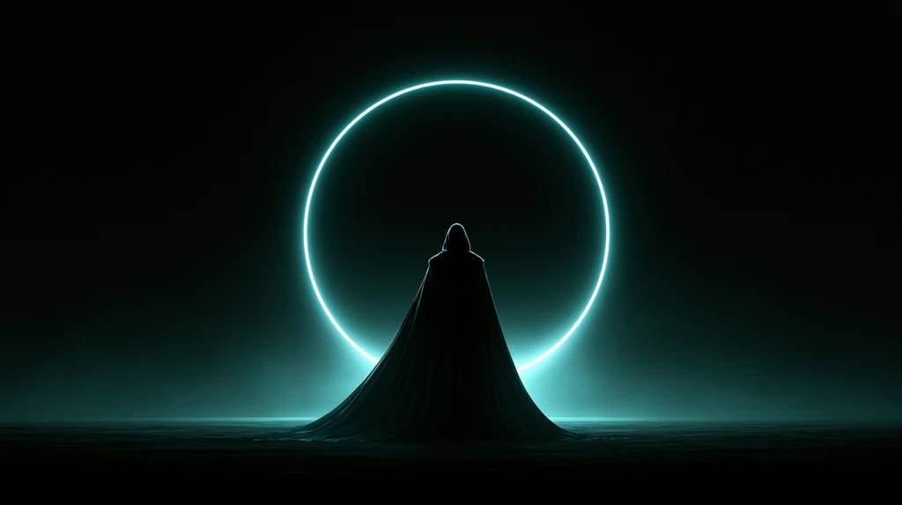
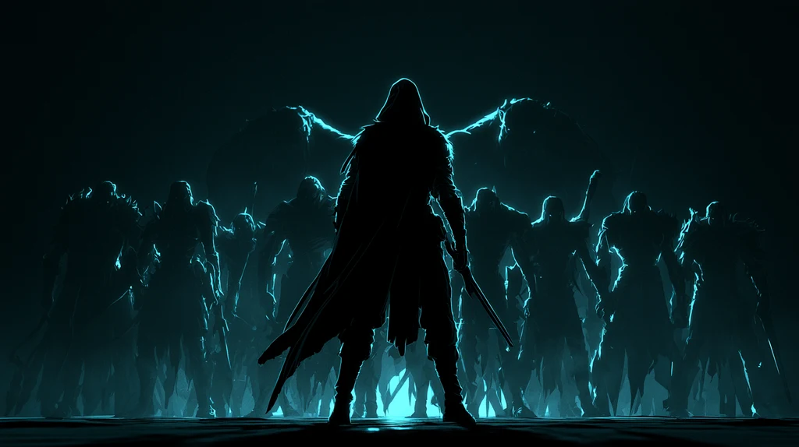
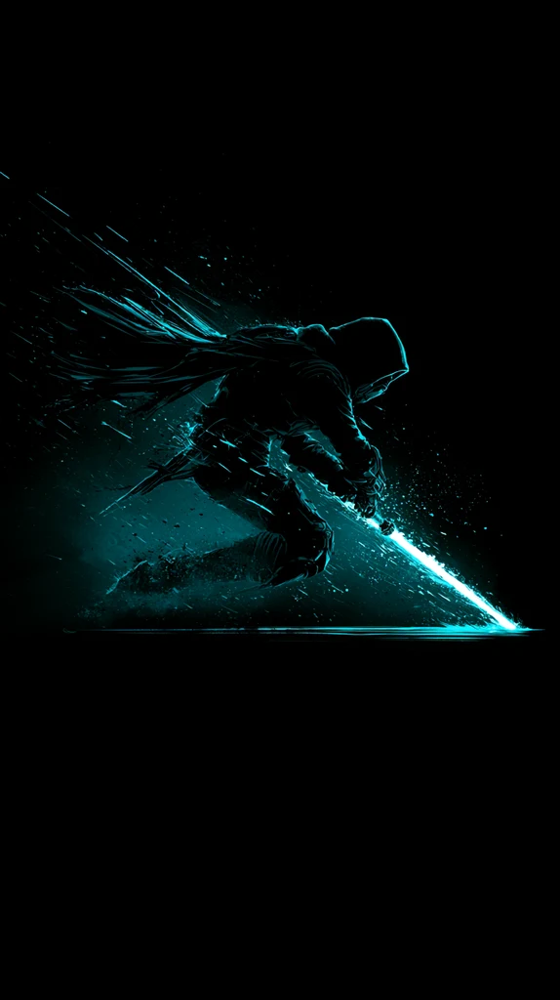

<div align="center">



# Hollow Hunter

**Build your character by building your body.**

A GPS fitness RPG where your real-world workouts level up a hunter who clears
monster gates, extracts a shadow army, and climbs a global ranking ladder.


</div>

---

## What it is

Your body is the character sheet. Exercise logged from a smartwatch or phone
(Health Connect) earns EXP and raises stats. As you walk the real world, monster
**gates** appear around you on a live street map. Enter one and it resolves as a
turn-based party fight — you plus three chosen shadows against the gate's
monsters. Win, and you **extract** the boss as a shadow soldier and loot gear.
Gates and raids scale endlessly to meet your growing power, and a Supabase-backed
leaderboard shows where you stand.

The design goal is *productive play*: progress in the game is progress in your
life. You can't buy power here — only training earns it.

> Built as an original work *inspired by* the Solo Leveling power fantasy —
> original name, hunter, System UI, and mechanics.

<div align="center">

&nbsp;&nbsp;

</div>

## Core loop

```
   REAL WORKOUT              WALK AROUND (GPS)            CLEAR A GATE
  (watch / phone)     →     gates spawn near you   →   turn-based party fight
        │                                                     │
        │                                                win / lose (no penalty)
        ▼                                                     │
   EXP + stat gains  ◄────────  loot: gear,      ◄────────────┘
   → higher level               shadow extraction
   → higher power               → army grows
        │                                                     │
        └──────────►  higher-rank gates + raids appear  ◄─────┘
```

## Features

- **Fitness → power.** Steps and workouts sync from Health Connect / GPS and
  convert to EXP and stat growth. No pay-to-win.
- **Live vector map.** Real OpenStreetMap street/water geometry for the play area,
  projected (Web Mercator) and drawn in-engine in a dark palette — no tile
  server, no map SDK. Gates, sanctuaries, lore stones and the player's stronghold
  are placed on real points of interest.
- **Turn-based party combat.** You + 3 shadows vs. trash-and-boss encounters;
  class move sets, crits, boss telegraphs, Auto / Skip.
- **Shadow army.** Extract defeated bosses as soldiers; grade, level, fuse,
  equip, favourite, and nickname them; field a squad of six.
- **Gear & armour sets.** 7-slot loadouts per unit, enhancement, set bonuses,
  rank-scaled loot tables.
- **Endless endgame.** The Nadir (scaling solo raid), gate-breaks (at-home
  emergency events), incursions (deterministic weekly zone events), gate tickets.
- **Global ranking.** Supabase leaderboard — only aggregates leave the device
  (level, power, floor reached), never raw health or precise location.
- **Portrait, one-handed, walk-optional.** Designed for real use while out.

## Architecture

The project's discipline is a hard split between **pure logic** and **presentation**:

| Layer | Contents | Tested |
|---|---|---|
| `core/` | Plain GDScript — stats, inventory, combat math, geofence/distance, loot, save data. No `Node`, no scene tree, no engine calls. | 25 modules, **532 GUT unit tests** |
| `scenes/` | `.tscn` files + thin view scripts that wire `core/` classes to nodes. No game rules. | Manual / on-device |
| `native/android/` | Kotlin Godot plugin — FusedLocationProvider GPS + Health Connect bridge. | On physical device |
| `content/` | Authored data — 54 monsters, moves, equipment, shop, the map extract. | — |

Anything that decides an outcome lives in `core/` behind a pure function with a
unit test. If a bug can only be reproduced by clicking through the running game,
that's a signal the logic needs to move to `core/`.

Feature work is spec-driven: each system gets a design doc in
`docs/superpowers/specs/` and a task-by-task implementation plan in
`docs/superpowers/plans/` before code is written.

**Tech:** Godot 4.7 · GDScript (static typing throughout, `gdformat` + `gdlint`
enforced) · [GUT](https://github.com/bitwes/Gut) for unit tests · Kotlin
(Android v2 plugin API) · OpenStreetMap via Overpass · Supabase (PostgREST +
Row-Level Security).

## Repository layout

```
core/            pure game logic (unit-tested)
scenes/          Godot scenes + thin view scripts
native/android/  Kotlin GPS / Health Connect plugin source
content/         authored JSON + the map data extract
tools/           map-extract pipeline, theme builder, art helpers
tests/unit/      GUT tests, one file per core/ module
docs/            concept & business docs, per-feature specs and plans
```

## Building

Requires **Godot 4.7** (Mono/.NET build). Open `project.godot` in the editor,
or run headless.

```bash
# unit tests
godot --headless -s addons/gut/gut_cmdln.gd -gdir=res://tests/unit -gexit

# regenerate the UI theme resource
godot --headless --script res://tools/build_theme.gd
```

The Android build uses a custom Gradle template (portrait-mode manifest patches
+ the native plugin) — see `native/android/README.md`. GPS and Health Connect
are verified on a physical device; they do not work in the emulator.

## Status

Solo project, in active development (209 commits, build-in-public). The core
systems — fitness sync, map, combat, army, gear, raids, leaderboard — are
implemented and unit-tested; art is placeholder-first, with a final asset pass
planned. Not yet released.

## Licence

[MIT](LICENSE) — the code is here to be read and learned from.
